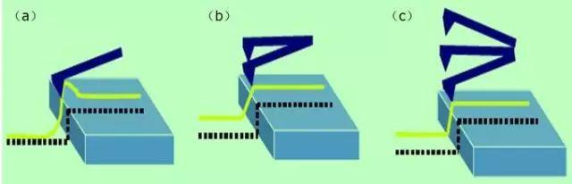
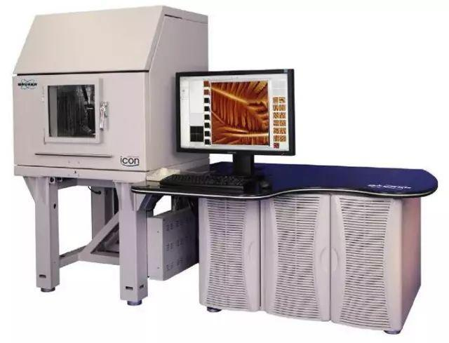

# AFM(原子力显微镜)

## 0. Video

原子力显微镜的原理：https://www.youtube.com/watch?v=7Iqm1ssiv5g

原子力显微镜原理（AFM)基础：https://www.bilibili.com/video/BV1AT4y1J7Fi?spm_id_from=333.337.search-card.all.click&vd_source=4eae4971dfe22b320ea4706b4ddcb436

## 1. 原子力显微镜的样品制备

根据针尖与试样表面相互作用力的变化，AFM主要有3种操作模式：接触模式(contact mode),非接触模式(non-contact mode)和敲击模式(tapping mode)。

**接触模式（Contact Mode）**：AFM最直接的成像模式。在整个扫描成像过程之中，探针针尖始终与样品表面保持接触，而相互作用力是排斥力。扫描时，悬臂施加在针尖上的力有可能破坏试样的表面结构，因此力的大小范围在10-10～10-6Ｎ。若样品表面柔嫩而不能承受这样的力，则不宜选用接触模式对样品表面进行成像。

**非接触模式（non-contact mode）**：非接触模式探测试样表面时悬臂在距离试样表面上方5～10nm的距离处振荡。样品与针尖之间的相互作用由范德华力控制，通常为10-12Ｎ，样品不会被破坏，而且针尖也不会被污染，特别适合于研究柔嫩物体的表面。不足之处，要在室温大气环境下实现这种模式十分困难。因为样品表面不可避免地会积聚空气中的水，它会在样品与针尖之间搭起小小的毛细桥，将针尖与表面吸在一起，从而增加尖端对表面的压力。

**轻敲模式（Tapping Mode）**：轻敲模式介于接触模式和非接触模式之间，是一个杂化的概念。悬臂在试样表面上方以其共振频率振荡，针尖仅仅是周期性地短暂地接触/敲击样品表面。这就意味着针尖接触样品时所产生的侧向力被明显地减小了，因此当检测柔嫩的样品时，AFM的敲击模式是最好的选择之一。一旦AFM开始对样品进行成像扫描，装置随即将有关数据输入系统，如表面粗糙度、平均高度、峰谷峰顶之间的最大距离等，用于物体表面分析。同时，AFM还可以完成力的测量工作，测量悬臂的弯曲程度来确定针尖与样品之间的作用力大小。

图1 AFM三种操作模式的比较（a）接触模式；（b）非接触模式；（c）轻敲模式。

**粉末样品的制备**：粉末样品的制备常用的是胶纸法，先把两面胶纸粘贴在样品座上，然后把粉末撒到胶纸上，吹去为粘贴在胶纸上的多余粉末即可。

**块状样品的制备**：玻璃、陶瓷及晶体等固体样品需要抛光，注意固体样品表面的粗糙度。

**液体样品的制备**：液体样品的浓度不能太高，否则粒子团聚会损伤针尖。（纳米颗粒：纳米粉末分散到溶剂中，越稀越好，然后涂于云母片或硅片上，手动滴涂或用旋涂机旋涂均可，并自然晾干）。

## 2. 原子力显微镜的操作步骤

我们以布鲁克Dimension ICON原子力显微镜为例，介绍操作过程。

图2 布鲁克Dimension ICON原子力显微镜

### **2.1 开机**

a）打开计算机主机、显示器

b）打开Nanoscope控制器

c）打开Dimension Stage控制器

### **2.2 安装探针**

a）选择并安装合适的探针和探针夹

b）安装探针

c）安装探针夹到仪器上。

### **2.3 调节激光**

a）将激光打在悬臂前端；调整检测器位置

### **2.4 启动软件**

a）双击桌面Nanoscope软件图标

b）进入实验选择界面，根据方案，第一步选择实验方案，第二步选择实验环境，第三具体操作模式

c）结束上述步骤后，单击界面右下方图标“Load Experiment”，进入具体实验设置界面

### **2.5 在视野中找到探针**

在视野中预先找到探针位置非常重要。若不如此做，可能会发生撞针的情况。

### **2.6 进样**

a）样品制备；b）聚焦样品。

**2.7 扫描图像**

**第一-ScanAsyst智能模式**

a）选择实验具体模式，ScanAsyst智能模式

b）选择实验环境，Air

c）进入实验界面

d）根据上面提到的步骤，调整激光，并将Head靠近样品表面以看清样品

e）点击 “Check Parameters” 图标，进入实验参数设置

f）设定以下扫描参数：Scan size小于 1 um ，X offset和 Y offset设为 0， Scan angle 设为 0， ScanAsyst Auto Control 设为 ON

g）点击 Engage进针

h）进针结束开始扫图。将 Scan size 设置成要扫描的范围

ScanAsyst是世界上第一个自动优化成像参数的AFM扫描模式，这项Bruker专利的创新性技术采用智能演算方法去自动连续地监测图像质量，并适时地作出相应的参数调整。使用ScanAsyst模式，研究人员不必再去繁琐地调整setpoint、反馈增益、扫描速度等参数，只要选定你所需要的扫描区域和扫描范围，不论是在大气下还是在溶液中，都可以轻松获得高质量图像。

ScanAsyst可精确控制针尖与样品的作用力，可远低于Tapping Mode所需要的力，减少针尖在样品表面的划痕，保证获得无损伤高分辨的图像。

**第二-Tapping 模式**

a）点击实验方案选择图标，打开界面

b）选择实验具体模式，Tapping Modee

c）选择实验环境Air进入实验界面

d）根据上面提到的步骤，调整激光，并将Head靠近样品表面以看清样品

e）点击 “Check Parameters” 图标

f） 设定以下扫描参数：Scan size小于 1 um，X offset和 Y offset设为0

g）Scan angle 设为 0

h）Tapping模式需找探针固有振动频率。点击“Auto Tune”，可以得到探针的共振峰

i）点击 Engage进针

j）进针结束开始扫图，将Scan size 设置成要扫的形貌大小

k）观察Height Sensor图中观察Trace和Retrace两条曲线的重合情况

l）优化Setpoint。在 Tapping模式下，调节Amplitude setpoint直到Trace和Retrace两条扫描线基本一致

m）优化Integral gain和 Proportional gain，一般的调节方法为：增大 Integral gain，使Trace和Retrace曲线开始震荡，然后减小 曲线开始震荡，然后减小Integral gain直到震荡消失，接下来用相同的办法调Proportional gain。通过调节增益来使两条扫描线基本重合并且没有震荡

n）调节扫描范围和速率。随着的增大，必须相应降低调节扫描范围和速率

o）如果样品很平，可以适当减小Z Range的数值，这将提高 Z方向的分辨率

**第三-Contact 模式**

a）点击实验方案选择图标 ，打开实验方案选择

b）选择实验具体模式，Contact Mode

c）选择实验环境，Air

d）进入实验界面

e）根据上面提到的步骤，调整激光，并将Head靠近样品表面以看清样品

f）点击“Check Parameters”图标，进入实验参数设置

g）设定以下扫描参数：Scan size小于1 um，X offset和 Y offset设为 0，Scan angle 设为0

h）点击Engage 进针

i）进针结束开始扫图。将 Scan size 设置成要扫的形貌大小

j）观察 Height Sensor 图中观察 Trace和Retrace 两条曲线的重合情况

k）优化 Integral gain和 Proportional gain。一般的调节方法为：增大Integral gain，使Trace和Retrace曲线开始震荡，然后减小 Integral gain直到震荡消失，接下来用相同的办法来调节 Proportional gain。通过调节增益来使两条扫描线基本重合并且没有震荡

l）优化Setpoint。在Contact模式中，调节Deflection setpoint直到Trace和Retrace两条扫描线基本一致

m）调节扫描范围和扫描速率。随着扫描范围的增大，扫描速率必须相应降低。大的扫描速率会减少漂移现象，但一般只用于扫描小范围的很平的表面

n）如果样品很平，可以适当减小Z Range的数值，这将提高Z方向的分辨率

### 2**.8 存图**

对扫描图像存图，通过可以设置文件名及存图路径

### **2.9 退针**

点击Withdraw，退针

### **2.10 关机**

a）关闭Nanoscope 软件

b）关闭Nanoscope 控制器

c）关闭Dimension Stage控制器

d）关闭计算机和显示器

## 3. 原子力显微镜的伪像分析

原子力显微镜的一个重要应用就是对样品表面的微纳米级尺寸特征进行成像，但在扫描成像的过程中，由于针尖的影响作用，使得扫描所获图像是原子力探针和样品共同作用的结果，而不是样品形貌的真实描述。

## 4. 测试技巧

**样品的预处理**：在显微镜下看样品表面是否干净，平整，如果有污染或不平整，务必重新制样。虽然针尖能测试的有效高度为6微米，水平范围100微米。但事实上，水平和高度方面任接近何一个极限，所测得的图象效果将很差，且针尖很容易破坏和磨损。

**下针**：在选好模式下针前，务必找到样品表面，调好焦距。扫描范围先设置为0，当针尖接触到样品表面后，再扩大扫描范围，保护下针时破坏针尖。

**扫图**：为了得到好的图象，须调好trace和retrace，一般来说调电压效果会好一些。探针在多次使用后或样品表面比较粗糙，扫描范围太小时，trace和retrace重合会比较困难，可以增大扫描范围或将样品烘干后再测。测试时应保持安静，空调等低频噪音也会影响测试；如果环境太吵，可以降低图象分辨率，减小外界的影响，或降低扫描频率。

**Integral gain和 Proportional gain**：反馈系统的两个增益值主要用来设定探针的反馈能力。适当提高I gain和P gain的值以提高系统的响应性，但是这两个参数不宜过高，否则会使扫描器振荡，致使图像出现失真。