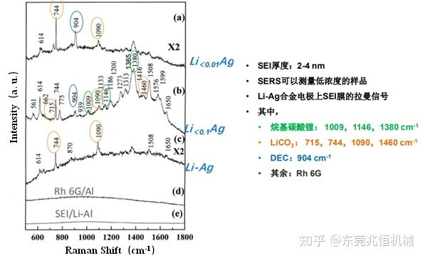

# 共焦拉曼光谱仪Confocal Raman spectroscopy

## 1. **Raman基本原理和仪器应用**

### 1.1 拉曼效应

​		光散射是自然界常见的现象。晴朗的天空之所以呈蓝色、早晚东西方的空中之所以出现红色霞光等，都是由于光发生散射而形成了不同的景观。拉曼光谱是一种散射光谱。在实验室中，我们通过一个很简单的实验就能观察到拉曼效应。在一暗室内，以一束绿光照射透明液体，例如戊烷，绿光看起来就像悬浮在液体上。若通过对绿光或蓝光不透明的橙色玻璃滤光片观察，将看不到绿光而是一束十分暗淡的红光，这束红光就是拉曼散射光。拉曼光谱仪采用的是激光照射待测物质，**当一束激发光的光子与作为散射中心的分子发生相互作用时，大部分光子仅是改变了方向，发生散射**，而光的频率仍与激发光源一致，这种散射称为**瑞利散射**。但也存在**很微量的光子不仅改变了光的传播方向，而且也改变了光波的频率**，这种散射称为**拉曼散射**。其散射光的强度约占总散射光强度的10^-6^～10^-10^。拉曼散射的产生原因是光子与分子之间发生了能量交换改变了光子的能量。

### 1.2 拉曼基本原理

​		当光打到样品上时，样品分子会使入射光发生散射，若部分散射光的频率发生改变，则**散射光与入射光之间的频率差称为拉曼位移**。**拉曼光谱仪主要就是通过拉曼位移来确定物质的分子结构**，针对固体、液体、气体、有机物、高分子等样品均可以进行定性定量分析。因此，与红外吸收光谱类似，对拉曼光谱的研究，也可以得到有关分子振动或转动的信息。目前拉曼光谱分析技术已广泛应用于物质的鉴定、分子结构的研究。

​		**同一种物质，随着入射光频率的改变，拉曼散射光的频率也随之发生改变，但拉曼位移Δν保持不变**，**拉曼位移与入射光的频率无关，仅与物质的振动和转动能级有关**。不同的物质有不同的振动和转动能级，因此拉曼位移不同。

### 1.3 拉曼位移

​		在透明介质散射光谱中，入射光子与分子发生非弹性散射，分子吸收频率为ν0 的光子，发射ν0-ν1的光子，同时电子从低能态跃迁到高能态（斯托克斯线）；分子吸收频率为ν0的光子，发射ν0+ν1的光子，同时电子从高能态跃迁到低能态（反斯托克斯线）。靠近瑞利散射线的两侧出现的谱线称为小拉曼光谱；远离瑞利散射线的两侧的谱线称为大拉曼光谱。斯托克斯与反斯托克斯散射光的频率与激发光源频率之差Δν统称为拉曼位移（Raman Shift），Δν= |ν拉曼散射-ν激发光|；也可表示为：拉曼位移=激光波数-拉曼光波数。拉曼位移取决于分子振动能级的变化，不同的化学键有不同的振动方式，决定了其能级间的能量变化，因此，与之对应的拉曼位移是特征的。与分子红外光谱不同，极性分子和非极性分子都能产生拉曼光谱。这是拉曼光谱进行分子结构定性分析的理论依据。

### 1.4 拉曼光谱

​		通常将拉曼散射强度相对波数的函数图称为拉曼光谱图。图1展示的是同素异形体石墨和金刚石的拉曼光谱图（左）以及某一未知物的拉曼光谱图（右）。拉曼光谱x轴的惯用单位是相对激发光波长的频率偏移，一般用波数表示，简称拉曼位移或拉曼频移。若波长以厘米计，波数就是波长的倒数，即每厘米波的数目。比如，绿光的波长为500nm（500*10^-7^cm），其波数即为20000cm^-1^。

波数与能量E的关系如公式（1）所示：

因此，拉曼光谱的x轴正好是激光波长和拉曼光波长以波数计的差。例如：用514.50nm激光激发氮气的拉曼散射，其波长为584.54nm。对该氮拉曼峰以波数计的拉曼频移如公式（2）：

### 1.5 拉曼光谱的优势

### 1.6 拉曼光谱仪与红外光谱仪的对比

### 1.7 拉曼光谱在能源存储领域的应用

​		拉曼光谱技术以其信息丰富，制样简单，水的干扰小等独特的优点，为化学、材料、物理、高分子、生物、医药、地质等领域的研究提供了快速、简单、可重复、且无损伤定性定量分析的方法。拉曼光谱仪除了能够得到物质的光谱信息外，还能得到相应的拉曼成像，了解物质各组分的分布情况等。

#### 1.7.1锂电领域

1）分析正极材料

案例一：Li(Mn, Fe)氧化物

Fe部分取代了Mn的不同组分Li(Mn, Fe)~2~O~4~的六个样品

案例二：识别正极材料及循环产物—钴酸锂LiCoO~2~

案例三：锂离子电池LiCoO~2~电极分析

案例四：锂离子电池电荷状态（SOC）的成像

案例五：锂离子电池电荷状态（SOC）——老化后的电池

2）分析负极材料

案例一：分析负极碳材料的种类

案例二：负极各组分分布

案例三：评价石墨负极的劣化

案例四：评价不同的还原GO中的缺陷

案例五：用于电动车的新型电池——硅-碳负极材料

案例六：探测低浓度粘合剂

案例七：固体电解质中间相（SEI）SERS表征

#### 1.7.2其他储能设备

​		拉曼光谱在非对称超级电容器MnO~2~/活性炭复合电极材料的应用。

## **2.** **Raman系统主要构成**

​		拉曼光谱仪主要由激光光源、样品装置、滤光器、单色仪、显微镜系统和检测器等构成。以Renishaw inVia reflex为例，仪器结构如下所示：

### 2.1 激光器

​		激光器主要提供激发光源。激光器用作拉曼光谱的激发光源对拉曼光谱术的快速发展起到了至关重要的作用。由于拉曼散射很弱，要求的光源强度大，而激光器提供的激发光源具有极高的亮度、方向性强、谱线宽度十分狭小以及发散度极小，可传输很长的距离而保持高亮度。因此，一般用激光器提供激发光源。

​		激光器种类很多，常用的激光器有：Ar离子激光器、Kr离子激光器、He-Ne激光器，Nd-YAG激光器，二极管激光器等。根据所用材料不同大致可分为气体激光器、固体激光器、半导体激光器和染料激光器等。半导体激光器是所有激光器中效率最高和体积最小的一种。这种激光器可通过改变电流、外部磁场、温度或压力微调输出激光的波长，也可通过改变半导体合金的组分而能在0.32~0.45μm的范围内进行调谐。

​		拉曼光谱仪一般都配备多种激光器，当一种激光激发样品时产生很强的光致发光干扰信号时，就改用另一种激光，目的是避开光致发光的干扰。

### 2.2 外光路系统

​		外光路系统是指在激光器之后、单色仪之前的一套光学系统（包括样品池）。它的作用是为了有效地利用光源强度、分离出所需要的激光波长、减少光化学反应和减少杂散光、以及最大限度地收集拉曼散射光，还要适合于不同状态的试样在各种不同条件下（如高、低温）的测试。纯化后的激光经反射镜改变光路再由物镜准确地聚焦在样品上。样品所发出的拉曼散射光再经聚光透镜准确地成像在单色器的入射狭缝上。反射镜的作用是将透过样品的激光束及样品发出的散射光反射回来再次通过样品，以增强激光对样品的激发效率，提高拉曼散射光的强度。

### 2.3 样品装置

​		样品装置包含在外光路系统中。样品架的设计要保证使照明最有效和杂散光最少，尤其要避免入射激光进入光谱仪的入射狭缝。为此，对于透明样品，最佳的样品布置方案是使样品被照明部分呈光谱仪入射狭缝形状的长圆柱体，并使收集光方向垂直于入射光的传播方向。

​		拉曼样品主要有：透明液体、透明固体、不透明固体、加温样品、背向散射样品和前向散射样品。可有各种各样的样品放置方式，包括直接的光学界面，显微镜，光纤维探针（不接触或光学浸入）和样品室（包括特殊的样品盛器和自动样品转换器）。样品光路也可被设计成能获得偏振相关拉曼光谱，这种光谱通常包含附加信息。样品装置的选择应根据待测物的具体情况（如样品的状态、体积等）以及测量的速度，激光的安全性和样品图谱的质量要求等决定。由于在可见光区域内，拉曼散射不会被玻璃吸收，因此拉曼光谱的一大优点是样品可放在玻璃制成的各种样品池中，这给样品的拉曼测试带来很大便利。

### 2.4 显微镜系统

​		装有显微镜的拉曼光谱仪能够做到微区分析，与之相应的技术常称为显微拉曼光谱术（Micro-Raman Spectroscopy）。借助显微镜系统，仪器既能显示材料很小区域的形貌（对透明材料也能观察到内部结构），又能收集到该区域的拉曼光谱散射光。横向分辨率可达到微米级别。共聚焦显微镜的出现，优化了轴向分辨率。聚焦得很好的激光束给出很小的斑点大小，从而能获得更好的横向空间分辨率，而激光束的快速发散则能获得好的轴向（深度）分辨率。通常，激发光通过显微镜物镜聚焦于试样上，拉曼散射光则由同一物镜收集后送入光谱仪。显微镜载物台能使试样相对物镜作精确的三维移动，装显微镜的最大好处就是能观察到试样的放大像，并能从中选定发出拉曼散射光的试样微区，这样能够既容易又快捷的对试样给定区域进行对光，又有助于确保获得的光谱是来自材料感兴趣的区域，而不是存在污染物质或不具代表性的区域；配备显微镜的另一好处就是激光斑点很小，便于研究很小的试样区域，但是不容易得到一个大范围内的平均光谱信号。

### 2.5 滤光器

​		激光波长的散射光（瑞利光）要比拉曼信号强几个数量级，必须在进入检测器前滤除，另外，为防止样品不被外辐射源（例如：房间的灯光，激光等离子体）照射，需要设置适宜的滤波器或者物理屏障。安置滤光部件的主要目的是为了抑制杂散光以提高拉曼散射的信噪比。在样品前面，典型的滤光部件是前置单色器或干涉滤光片，它们可以滤去光源中非激光频率的大部分光能。在样品后面，用合适的干涉滤光片或吸收盒可以滤去不需要的瑞利线的一大部分能量，提高拉曼散射的相对强度。

### 2.6 分光系统 

​		从分光机理上来看，拉曼光谱仪可以分为两大类，即色散型拉曼光谱仪和非色散型拉曼光谱仪，传统的拉曼光谱仪都是利用光栅进行分光的，称为色散型拉曼光谱仪，而非色散型拉曼光谱仪，即傅里叶变换拉曼光谱仪是利用干涉仪，通过傅里叶变换得到其拉曼光谱。对于Renishaw Raman光谱仪来说，采用的是高刻线的光栅进行分光，光栅的单位是每毫米刻多少道，对于雷尼绍拉曼光谱仪来说，一般532nm配的是1800刻线/毫米或者2400刻线/毫米的光栅，而785nm配的是1200刻线/毫米的光栅，325nm配的是3600刻线/毫米的光栅，因为这样搭配的效率好。

### 2.7 探测、放大和记录系统

​		探测器又称检测器，在拉曼光谱仪中，被用于探测仪器收集到的拉曼散射光或经过变换的信号。传统的拉曼光谱仪一般采用光电倍增管或电子计数器作为检测器，用于对分光后的光谱逐点（即逐频率）扫描以得到完整的拉曼光谱。常用的探测器有硅CCD探测器、紫外强化CCD探测器、近红外（NIR）单元探测器和光电倍增管。CCD检测器元件实际上是光敏电容器。由于光电效应，吸收光子产生了电荷并将其储存于电容器中，储存电荷的量正比于击中像元的光子数。将这些电荷送往电荷敏感放大器以测得累积电荷。放大器输出是数字化的，并储存于计算机中。液氮冷却的CCD电子耦合器件探测器的使用可大大提高探测器的灵敏度。硅质CCD是色散仪器中最常用的检测器，响应范围为200nm-1100nm。这种冷却的阵列检测器允许在低噪声下的快速全光谱扫描，适用于检测紫外-近红外激光器激发的拉曼信号。

## 共聚焦

​		在光学显微镜中，共焦意味着被照射的样本点和光束路径内的针孔有着共同的焦点。在实际应用中，与使用整个样品相反，只有一小部分的样品被点状光源照射。接着，针孔会阻挡未聚焦的光，从而增加对比度和景深。

**什么是共焦拉曼显微镜？**

该原理可应用于拉曼光谱，从而增强沿x、y-（横向）和z-轴（深度）的空间分辨率，同时还能够进行深度剖析。 不过，拉曼显微镜的共焦设计可能有所不同。

**真共焦设计**

真共焦拉曼显微镜的最大优势在于其具有独立的空间控制和光谱分辨率。这是通过在光谱仪入口狭缝前放置针孔而实现的。然后，可调节的针孔可以控制共焦度，入口狭缝则可控制光谱仪的光谱分辨率。 这种设计的缺点在于，很难通过使这个两个孔理想地对准，来确保最佳性能。

**赝共焦设计**

在简化的配置中，您可以通过一个方向上的入口狭缝和正交方向上的CCD探测器空间分辨率来控制空间分辨率。在空间分辨率方面，光谱仪的局限性会导致系统性能下降，但减少伪共聚焦装置中的光学元件数量，又能显著提高整体通量。

**混合共焦设计(FlexFocus)**

由于高通量和真共焦设计都能带来明显优势，拉曼显微镜可配备一个混合孔径阵列，该阵列包含一组针孔和狭缝，用于作为共焦孔径和光谱仪入口。这种混合设计将两种设计的优点合二为一，可按需进行真共焦或高通量设置。

